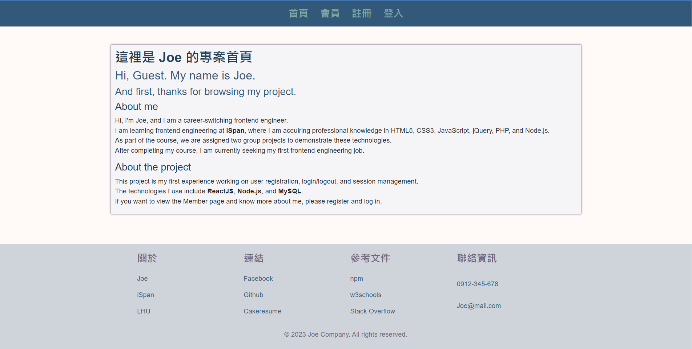

# my_web

## 網頁預覽



> 此專案必須配合資料庫以及後端專案，並在本地端(localhost)才能執行。
> 後端專案連結:
> https://github.com/JoeChou0810/portfolio/tree/main/my_web/register-login-be

## 安裝專案

使用版本

```
node v18.12.1
```

XAMPP Windows 7.4.30-1

> https://sourceforge.net/projects/xampp/files/XAMPP%20Windows/7.4.30/

使用 XAMPP 建立網頁伺服器，並到 phpMyAdmin 建立使用者帳號，並新增資料庫，匯入 sql 檔。(後端專案目錄提供)

> 帳號密碼請依據創建內容填寫進.env 檔，新增的資料庫名稱請取名為 my_web

分別在前、後端的終端機安裝 modules

```
npm install
```

在後端終端機安裝 nodemon

```
npm install nodemon
```

## 環境變數

請參考 .env.example 的內容，並在專案後端目錄新增 .env 檔並輸入環境變數。

> 帳號密碼請依據在 phpMyAdmin 中創建的填入

```
DB_HOST=localhost
DB_PORT=3306
DB_USER=
DB_PWD=
DB_NAME=my_web

SESSION_SCRECT=
```

## 啟動方式

> 啟動前請先確認 node 版本號至少為**v18.12.1 或以上版本**。
> 前端頁面會在 **localhost:3000** 執行，後端可以在 **3001 查看 api 回覆內容**。

前端指令

```
npm start
```

> 請確認已將目錄 cd 至 my-app。

後端指令

```
npm run dev
```

> 請事先確認是否確實安裝 nodemon。

## 登入會員

使用預設帳戶即可登入會員，或至註冊頁面註冊帳戶。

```
account: guest01
password: 12345
```

## 專案使用技術

**前端**

- ReactJS
- Bootstrap5
- Sass

**後端**

- Node.js
- express
- MySQL

**套件**

- axios
- eslint
- prettier
- font-awesome
- react-router
